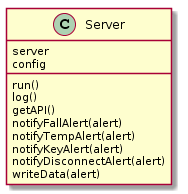
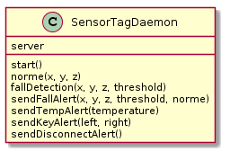

dmit-esir-project
=================

## TL;DR 

	sudo node bin/dmit-esir-project.js

## Introduction	

Domotic server to detect falls and rise alerts message to an Arduino system. This project is made by a group of students of the [ESIR Engineering School](https://esir.univ-rennes1.fr/) in the biomedical engineering speciality.

## Objectives of the projects

The main goal of this project is to create a telemonitoring system in order to follow some patients' physiological signals day after day. These data will be processed and alerts would be triggered if some problems happened to the patient.

This project currently monitor the heart rate of the patient and his balance to detect the patients movements (falls especially).

## Global architecture

### Sensors

We are using some sensors to monitor the patient:

 * Heart rate is monitored through a belt;
 * Balance is monitored through the accelerometer and the gyroscope of the [SensorTag](http://processors.wiki.ti.com/index.php/Bluetooth_SensorTag) from Texas Instrument.

### Server

The server which gathers the data and process them is a [`nodejs` server](http://nodejs.org/). In reaction, it will (or not) trigger actions through an [`Arduino`](http://arduino.cc/fr/) system. Actions can be such things as "call a doctor" if the patient has fallen for example. The link with the Arduino part is not currently implemented.

### SensorTag Daemon

This daemon will communicate with the `SensorTag` during all the time the application is launched. It will monitor `SensorTag`'s data and give alerts to the `Server`.

### Communication

Currently the communication between the `SensorTagDaemon` and the `Server` is realized with a direct reference in the program. In the future, it should be through an HTTP request, in order to use the REST architecture of the `Server`. The `SensorTag` send the data directly to the deamon using Bluetooth Low Energy (BLE).

The following part is not implemented yet, but it should be as described. The communication between the belt and the Nodejs server should be done through a [`Zigbee` wireless network]() to an intermediate Arduino, which will transmit the data to the server.

### Architecture of the project directory

The project directory should look like this.

	├── bin					# here is the script to start the program (daemon + server)
	├── doc 				# some documentations (mostly diagrams)
	├── lib 				# contains all the code of the server, database parts and the daemon too.
	├── LICENSE
	├── node_modules
	├── package.json
	├── README.md
	└── www 				# contains all the client-side code (webpages)

#### lib/

The `lib/` directory contains the following files.

	lib/
	├── class
	│   └── alert.js 			# describe an Alert
	├── config.js 				# contains the config (port for the web server, domain, url etc.)
	├── database.js 			# interface for the database
	├── sensortagDeamon.js 		# the daemon to communicate with the SensorTag
	└── server.js 				# the server itself

#### www/

The `www/` directory contains all the client-side files.

	www/
	└── portal
	    ├── about.html 			# "about" webpage
	    ├── contact.html 		# "contact" page
	    ├── css 				# contains all the css files
	    ├── details.html
	    ├── fonts
	    ├── img 				# contains the image files
	    ├── index.html 			# index of the website
	    └── js 					# contains all the js libs (Mustache for example)

## Requirement of this projet

 * OS: GNU/Linux, Mac OS
 * Installation of [`nodejs`](http://nodejs.org/),
 * Installation of [`MongoDB`](http://www.mongodb.org/),
 * A [SensorTag](http://processors.wiki.ti.com/index.php/Bluetooth_SensorTag) from Texas Instruments,
 * A Bluetooth 4.0 Low Energy dongle to communicate with the `SensorTag` (personnaly, I use the [plugable Bluetooth USB Adapter](http://plugable.com/products/usb-bt4le)),
 * [`Git`](http://git-scm.com/) (or [GitHub for Mac](http://mac.github.com/) if you are affraid of the command line).

### Installing `nodejs`

Node.js is a server-side framework which allows you to use JavaScript on this side. You can follow the detailed [download](http://nodejs.org/download/) and all the install instructions on the [Node.js](http://nodejs.org/) website.

Node.js comes with a little package manager for its modules. It is called `npm` for Node Package Manager. It is accessible by the `npm` command. Be sure you have it after the installation of Node.js, we will need it after.

### MongoDB

You can install MongoDB directly by your package manager in most of the cases (here on a Ubuntu system):

	sudo apt-get update && sudo apt-get upgrade	# get an updated system
	sudo apt-get install mongodb 				# install mongodb

You can find all the detailed install process regarding to your personnal distribution on the [MongoDB website](http://www.mongodb.org/downloads).

## Installation guide

We are assuming that you have successfully installed all the requirement needed for this project and you have to adapt the following commands to your own package manager. We need to install the dependencies required by this project. We will use the `npm` command.

	cd dmit-esir-project/	# Go to the project directory
	sudo npm install 		# Install all the dependencies required

Be sure that the node module [`noble`](https://npmjs.org/package/noble) is correctly installed after these commands. The same tip goes for the installation of [`xpc-connection`](https://npmjs.org/package/xpc-connection) if you are running this project on a Mac OS.

## Execution

You can start the project by the following command:

	sudo node bin/dmit-esir-project.js

But you can also make the script recognize as an executable script using `chmod` and then, just start the project using:

	./bin/dmit-esir-project.js

This command will start the webserver and the SensorTag deamon. But you can start the webserver on a custom port using the following command:

	sudo node bin/dmit-esir-project.js --port 8080

To see the available options, use the `--help` command:

	sudo node bin/dmit-esir-project.js --help

